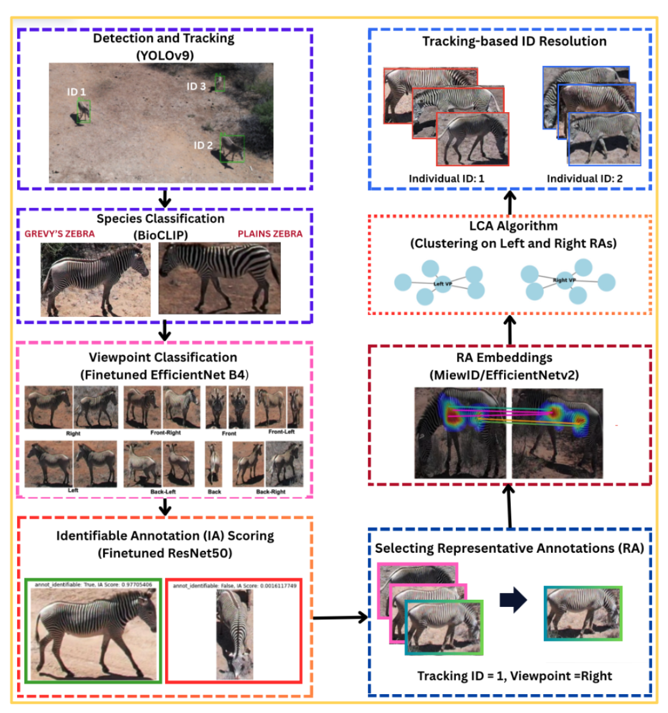

# MAVRIC: Multiview Representative Annotation Clustering for Drone-Based Animal Re-Identification

MAVRIC is a video-based animal re-identification pipeline for drone footage. Starting from raw videos and matching SRT telemetry files, the pipeline imports frames, detects and tracks animals with YOLOv9 and ByteTrack, classifies species and viewpoint, scores identifiable annotations, selects representative annotations from tracks, computes MiewID embeddings, clusters annotations with LCA, and reconciles left/right viewpoint clusters during postprocessing. The work supports drone-based re-identification for Plains Zebra, Grevy's Zebra, and Reticulated Giraffe.

<p align="center">
  
</p>

### Tags
- Software
- Animal Ecology
- Animal Re-Identification
- Drone Video

---

# Explanation

## Key Terms

* **Animal Re-Identification (re-id)**: Matching detections of an animal across video frames, viewpoints, and tracks so the same individual receives a consistent identity.
* **Representative Annotation (RA)**: A selected annotation from a track that is high quality and informative enough to represent that animal for identification.
* **Multiview Representative Annotation Clustering**: The MAVRIC workflow for clustering selected annotations by viewpoint, then linking left and right viewpoint clusters into final individual IDs.
* **Identifiable Annotation (IA)**: A detected animal crop with enough visible information for reliable identity matching. For zebra stripe-based re-ID, the side view is especially important.
* **Human-in-the-loop Postprocessing**: The final interactive step that resolves ambiguous merges/splits and verifies cross-view identity links.

## Repository Structure

This repository is trimmed to the video-based MAVRIC pipeline.

```
VAREID
├── algo
│   ├── detection/
│   ├── frame_sampling/
│   ├── ia_classification/
│   ├── import/
│   ├── lca/
│   ├── miew_id/
│   ├── postprocessing/
│   ├── species_identification/
│   └── viewpoint_classification/
├── drivers/
├── libraries/
│   ├── io/
│   └── ui/
├── models/
config.yaml
environment.yaml
snakefile.smk
```

## Pipeline Components

### Algorithm Components
Algorithm components are the individual stages of the video pipeline, such as video import, detection/tracking, species classification, viewpoint classification, IA scoring, frame sampling, MiewID embedding generation, LCA clustering, and postprocessing. They live in `VAREID/algo/[component_name]/`.

### Driver Scripts
Driver scripts in `VAREID/drivers/` connect the Snakemake workflow to the algorithm components. They parse the config, build the right paths, set up logging, and run each stage consistently.

### Models
Models are stored in `VAREID/models/`. This repository includes the YOLOv9 detector weights, viewpoint classifiers, IA classifiers, MiewID configuration through Hugging Face, and LCA verifier probabilities used by the video pipeline.

### Pipeline Workflow

The Snakemake workflow runs the automated stages through LCA. Postprocessing is intentionally run separately because it may require interactive verification.

```mermaid
flowchart LR
    n1["Video Import<br>import_video_driver.py"] --> n2["YOLOv9 Detection + ByteTrack Tracking<br>dt_video_driver.py"]
    n2 --> n3["Species Classification<br>si_driver.py"]
    n3 --> n4["Viewpoint Classification<br>vc_driver.py"]
    n4 --> n5["Identifiable Annotation Scoring<br>iac_driver.py"]
    n5 --> n6["IA Filtering<br>iaf_driver.py"]
    n6 --> n7["Representative Annotation / Frame Sampling<br>fs_driver.py"]
    n7 --> n8["MiewID Embeddings<br>mid_driver.py"]
    n7 -- annotations --> n9["LCA Clustering<br>lca_driver.py"]
    n8 -- embeddings --> n9
    n9 --> n10["Postprocessing + Cross-view ID Assignment<br>post_driver.py"]
    style n10 stroke-width:4px,stroke-dasharray: 5
```



## Input Format

The pipeline expects a recursive input directory containing drone videos. Each video must have a matching SRT telemetry file in the same directory with the same filename stem. For example:

```
flight_001.MP4
flight_001.SRT
```

Each SRT entry should contain frame timing and drone metadata, including timestamp, latitude, longitude, and altitude.

## Pipeline Stages

### 1. Video Import
`import_video_driver.py` reads the video directory, parses matching SRT files, extracts frames, and writes `video_data.json`.

### 2. Detection and Tracking
`dt_video_driver.py` uses YOLOv9 for animal detection and ByteTrack for video tracking. The output annotations include bounding boxes, detection confidence, frame metadata, and tracking IDs.

### 3. Species Classification
`si_driver.py` classifies each annotation with BioCLIP-style species labels. The current MAVRIC work uses Plains Zebra, Grevy's Zebra, and Reticulated Giraffe.

### 4. Viewpoint Classification
`vc_driver.py` predicts viewpoints such as left, right, front, back, and up. Left and right side views are used most heavily for individual re-identification.

### 5. Identifiable Annotation Classification
`iac_driver.py` scores whether each annotation is useful for individual identification.

### 6. IA Filtering
`iaf_driver.py` keeps identifiable annotations and simplifies viewpoint labels for downstream left/right clustering.

### 7. Representative Annotation / Frame Sampling
`fs_driver.py` selects high-quality representative annotations from each tracking sequence. This reduces redundant frames while preserving the best evidence for identity matching.

### 8. MiewID Embeddings
`mid_driver.py` computes visual embeddings for the selected annotations.

### 9. LCA Clustering
`lca_driver.py` clusters annotations within each viewpoint using embeddings and LCA verifier probabilities.

### 10. Postprocessing and ID Assignment
`post_driver.py` reconciles clusters across viewpoints, verifies ambiguous cases through the UI/database workflow, splits or merges clusters when necessary, and writes final postprocessed left/right annotation files.

---

# How-To Guides

## Setting Up a Python Environment

This pipeline should be run in a Linux-based conda environment. Use `environment.yaml` from the repository root.

| Package Manager | Command |
| --- | --- |
| conda | `conda env create -n [env name] -f environment.yaml` |
| mamba | `mamba env create -n [env name] -f environment.yaml` |

Activate the environment:

| Package Manager | Command |
| --- | --- |
| conda | `conda activate [env name]` |
| mamba | `mamba activate [env name]` |

## Setting Up a Config File

Use `config.yaml` as the template for new experiments. It is best to make a copy per experiment so each run has its own input, output, and model settings.

Required fields:
- `data_dir_out`: Output directory where pipeline results are written.
- `data_dir_in`: Input directory containing videos and matching SRT files.
- `data_video`: Keep this as `True` for this MAVRIC video pipeline.

Important model and output fields:
- `dt_model`: YOLOv9 detector weights, for example `yolov9c.pt`.
- `vc_model`: Viewpoint classifier weights.
- `ia_model`: Identifiable annotation classifier weights.
- `mid_model`: MiewID model identifier.
- `lca_separate_viewpoints`: Keep this as `True` for video postprocessing.

## Running the Automated Pipeline

Run Snakemake from the repository root. The Snakemake workflow runs through LCA clustering; postprocessing is run afterward.

```bash
snakemake -s snakefile.smk --cores 1 --configfile path/to/your_config.yaml
```

Useful flags:

| Flag | Function |
| --- | --- |
| `-s` | Path to the snakefile, usually `snakefile.smk`. |
| `--cores` | Number of CPU cores to use. |
| `--configfile` | Path to the experiment config file. |

If a previous run stopped unexpectedly and Snakemake reports a locked working directory, unlock it with:

```bash
snakemake -s snakefile.smk --unlock
```

## Running a Stage in Isolation

Driver scripts can be run directly as modules. Most drivers accept either a config path or the encoded config form used by Snakemake; for normal manual use, prefer the config path style supported by the driver you are calling.

Example:

```bash
python -m VAREID.drivers.fs_driver --config_path path/to/your_config.yaml
```

For lower-level control, run the algorithm component directly from `VAREID/algo/[component]/` and inspect its `argparse` help.

## Running Postprocessing

Postprocessing is not run by Snakemake because it may require human verification. Run it after the automated pipeline finishes:

```bash
python -m VAREID.drivers.post_driver path/to/your_config.yaml
```

The driver launches the postprocessing process and starts the GUI/database workflow. Resolve each prompted conflict in the UI. When all conflicts are resolved, the postprocessing outputs are written to the configured `post` directory.

### Continuing Postprocessing Later

Conflict decisions are stored in the SQLite decision database configured by `post_db_file`. If you stop midway, rerun `post_driver.py` with the same config and continue from the saved state.

## Adapting to Other Species

The current MAVRIC work uses Plains Zebra, Grevy's Zebra, and Reticulated Giraffe. To adapt the pipeline to another species, the most important pieces are:

1. Update species labels in `VAREID/algo/species_identification/species_identifier_config.yaml`.
2. Update `filtered_classes` in `VAREID/algo/viewpoint_classification/viewpoint_classifier_config.yaml`.
3. Train or supply viewpoint and IA classifier weights appropriate for the target species.
4. Confirm that the detector and tracker settings are appropriate for the camera altitude, animal scale, density, and motion.

---

## License

- MIT [](https://opensource.org/licenses/MIT)

## References

### Related Resources

* [YOLOv9](https://github.com/WongKinYiu/yolov9)
* [BioCLIP](https://github.com/Imageomics/bioclip)
* [MiewID](https://github.com/WildMeOrg/wbia-plugin-miew-id)
* [LCA](https://github.com/WildMeOrg/lca)

## Acknowledgements

* **National Science Foundation (NSF)** funded AI institute for Intelligent Cyberinfrastructure with Computational Learning in the Environment (ICICLE) (OAC 2112606).
* **Imageomics Institute (A New Frontier of Biological Information Powered by Knowledge-Guided Machine Learning)** is funded by the US National Science Foundation's Harnessing the Data Revolution (HDR) program under Award (OAC 2118240).
* Support from **Rensselaer Polytechnic Institute (RPI)**.
* Support from **Finnish Cultural Foundation**.
* Resources from **Ohio Supercomputer Center** made it possible to train and test algorithmic components.

## Citation

Ankit K. Upadhyay, Ekaterina Nepovinnykh, S. M. Rayeed, Aidan Westphal, Lawrence Miao, Julian Bain, Jaeseok Kang, Tuomas Eerola, Heikki Kälviäinen, Charles V. Stewart. *Animal Re-Identification via Multiview Spatio-Temporal Track Clustering*. Rensselaer Polytechnic Institute, LUT University, Brno University of Technology, CV4Animals, CVPR 2025.

Ankit Kumar Upadhyay, Ekaterina Nepovinnykh, Aidan Westphal, Jenna Kline, Maksim Kholiavchenko, Tuomas Eerola, Heikki Kälviäinen, Tanya Berger-Wolf, Daniel Rubenstein, Charles V. Stewart. *MAVRIC: Multiview Representative Annotation Clustering for Drone-Based Animal Re-Identification*. (Under review in International Journal of Computer Vision, invited for submission to IJCV 2025 Special Issue on Computer Vision for Animal Tracking and Modeling).
